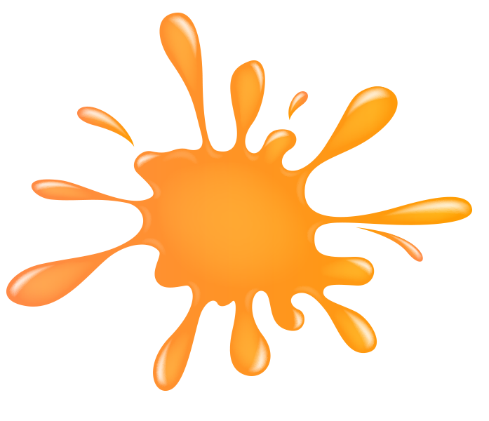
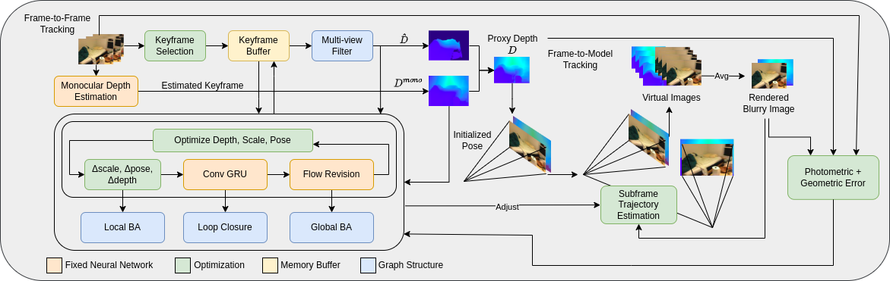

<h1 align="center">Deblur Gaussian Splatting SLAM</h1>
  <p align="center">
    <a href="https://www.linkedin.com/in/fragirla/" target="_blank"><strong>Francesco Girlanda<sup>1</sup></strong></a>
    ·
    <a href="https://rozumden.github.io/" target="_blank"><strong>Denys Rozumnyi<sup>1</sup></strong></a>
    ·
    <a href="https://cvg.ethz.ch/team/Prof-Dr-Marc-Pollefeys" target="_blank"><strong>Marc Pollefeys<sup>1,2</sup></strong></a>
    ·
    <a href="https://cvg.ethz.ch/team/Dr-Martin-R-Oswald" target="_blank"><strong>Martin R. Oswald<sup>1,3</sup></strong></a>
    
  </p>
  <p align="center">
      <strong><sup>1 </sup>ETH Zurich,  <sup>2 </sup>Microsoft, <sup>3 </sup>University of Amsterdam </strong>
      <strong><h4 align="center"><a href="https://arxiv.org/abs/2405.16544" target="_blank">Paper</a></h4></strong>
  </p>

<p align="center">
    
</p>

<p align="center">
<strong>Deblur-SLAM</strong> can successfully track the camera and reconstruct sharp maps for highly motion-blurred sequences. We directly
model motion blur, which enables us to achieve high-quality reconstructions, both on challenging synthetic (top) and real (bottom) data.
</p>

<p align="center">
    
</p>
<p align="center">
<strong>Deblur-SLAM Architecture</strong>. Given an RGB input stream, we estimate an initial pose through local bundle adjustment (BA)
using joint Disparity, Scale and Pose Optimization (DSPO). This pose is later refined through frame-to-model tracking that learns a sub-frame
trajectory. Each keyframe is then mapped, taking advantage of the estimated monocular depth. The sub-frame trajectory is applied to render
virtual sharp images, which model the physical image formation of blurry images. We optimize the photometric and geometric error between
the observed blurry image and the average of our sharp images. We further refine poses globally via online loop closure, global BA, and a
deformable 3D Gaussian map that adjusts for global pose and depth updates before each mapping phase.
</p>

<!-- TABLE OF CONTENTS -->
<details open="open" style='padding: 10px; border-radius:5px 30px 30px 5px; border-style: solid; border-width: 1px;'>
  <summary>Table of Contents</summary>
  <ol>
    <li>
      <a href="#installation">Installation</a>
    </li>
    <li>
      <a href="#run">Run</a>
    </li>
    <li>
      <a href="#acknowledgement">Acknowledgement</a>
    </li>
    <li>
      <a href="#citation">Citation</a>
    </li>
    <li>
      <a href="#contact">Contact</a>
    </li>
  </ol>
</details>


## Installation
1. Clone the repo using the `--recursive` flag 
```bash
git clone --recursive https://github.com/FraGirla/Deblur-SLAM.git
cd Deblur-SLAM
```
2. Creating a new conda environment. 
```bash
conda create --name deblur-slam python=3.10
conda activate deblur-slam
```
3. Install CUDA 11.7 using conda and pytorch 1.12
```bash
conda install conda-forge::cudatoolkit-dev=11.7.0
conda install pytorch torchvision torchaudio pytorch-cuda=11.8 -c pytorch -c nvidia
```
> Now make sure that "which python" points to the correct python
executable. Also test that cuda is available
python -c "import torch; print(torch.cuda.is_available())"

4. Update depth rendering hyperparameter in thirparty library
  > By default, the gaussian rasterizer does not render gaussians that are closer than 0.2 (meters) in front of the camera. In our monocular setting, where the global scale is ambiguous, this can lead to issues during rendering. Therefore, we adjust this threshold to 0.001 instead of 0.2. Change the value at [this](https://github.com/rmurai0610/diff-gaussian-rasterization-w-pose/blob/43e21bff91cd24986ee3dd52fe0bb06952e50ec7/cuda_rasterizer/auxiliary.h#L154) line, i.e. it should read
```bash
if (p_view.z <= 0.001f)// || ((p_proj.x < -1.3 || p_proj.x > 1.3 || p_proj.y < -1.3 || p_proj.y > 1.3)))
```
5. Install the remaining dependencies.
```bash
python -m pip install -e thirdparty/lietorch/
python -m pip install -e thirdparty/diff-gaussian-rasterization-w-pose/
python -m pip install -e thirdparty/simple-knn/
python -m pip install -e thirdparty/evaluate_3d_reconstruction_lib/
```

6. Check installation.
```bash
python -c "import torch; import lietorch; import simple_knn; import
diff_gaussian_rasterization; print(torch.cuda.is_available())"
```

7. Now install the droid backends and the other requirements
```bash
python -m pip install -e .
python -m pip install -r requirements.txt
python -m pip install pytorch-lightning==1.9 --no-deps
```

8. Download pretrained model.
Download the pretained models from [Google Drive](https://drive.google.com/file/d/1oZbVPrubtaIUjRRuT8F-YjjHBW-1spKT/view?usp=drive_link), unzip them inside the `pretrained` folder. The `middle_fine.pt` decoder will not be used and can be removed.
<details>
  <summary>[Directory structure of pretrained (click to expand)]</summary>
  
```bash
  .
  └── pretrained
        ├── .gitkeep
        ├── droid.pth
        ├── middle_fine.pt
        └── omnidata_dpt_depth_v2.ckpt

```
</details>


## Data Download

### Replica Blurry Dataset

Our sythetically blurred dataset based on Replica will be released soon.


## Run
For running Deblur-SLAM, each scene has a config folder, where the `input_folder`,`output` paths need to be specified. 

```bash
python run.py configs/ReplicaBlurry/office0.yaml
```

## Acknowledgement
Our codebase is partially based on [Splat-SLAM](https://github.com/google-research/Splat-SLAM), [BAD-Gaussians](https://github.com/WU-CVGL/BAD-Gaussians), [GlORIE-SLAM](https://github.com/zhangganlin/GlORIE-SLAM), [GO-SLAM](https://github.com/youmi-zym/GO-SLAM), [DROID-SLAM](https://github.com/princeton-vl/DROID-SLAM) and [MonoGS](https://github.com/muskie82/MonoGS). We thank the authors for making these codebases publicly available. Our work would not have been possible without your great efforts!

## Reproducibility
There may be minor differences between the released codebase and the results reported in the paper. Further, we note that the GPU hardware has an influence, despite running the same seed and conda environment.

## Citation

If you find our code or paper useful, please cite
```bibtex
@misc{girlanda2025deblurgaussiansplattingslam,
  title={Deblur Gaussian Splatting SLAM}, 
  author={Francesco Girlanda and Denys Rozumnyi and Marc Pollefeys and Martin R. Oswald},
  year={2025},
  eprint={2503.12572},
  archivePrefix={arXiv},
  primaryClass={cs.CV},
  url={https://arxiv.org/abs/2503.12572}, 
}
```
